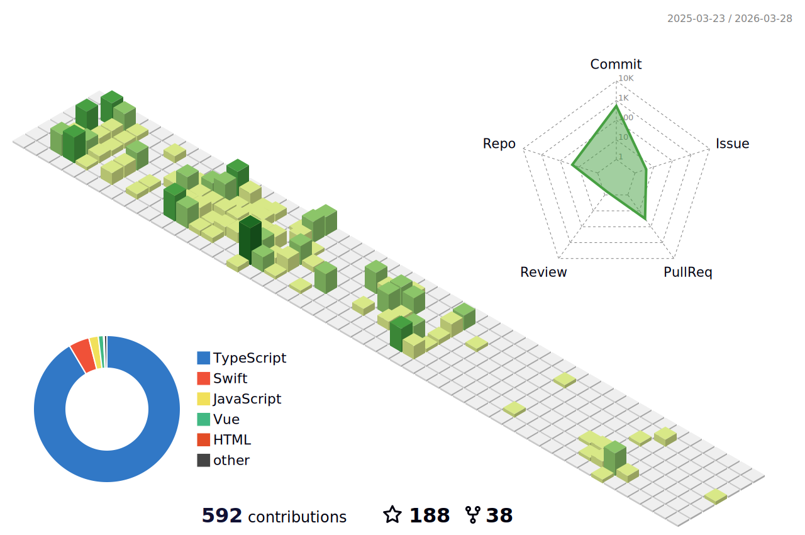

### 你好~ Hello~ 👋

✨我是一名前端开发攻城狮 小张 😄

✨I am a Web Developer，Amateur Web Designer who has just worked for one year, XiaoZhang 😄

✨欢迎来到我的GitHub主页

✨Welcome to my GitHub page
<!--
**7148505/7148505** is a ✨ _special_ ✨ repository because its `README.md` (this file) appears on your GitHub profile.

Here are some ideas to get you started:

- 🔭 I’m currently working on ...
- 🌱 I’m currently learning ...
- 👯 I’m looking to collaborate on ...
- 🤔 I’m looking for help with ...
- 💬 Ask me about ...
- 📫 How to reach me: ...
- 😄 Pronouns: ...
- ⚡ Fun fact: ...
-->

<!--START_SECTION:waka-->


**🐱 My GitHub Data** 

> 📦 96.7 kB Used in GitHub's Storage 
 > 
> 🏆 638 Contributions in the Year 2025
 > 
> 🚫 Not Opted to Hire
 > 
> 📜 64 Public Repositories 
 > 
> 🔑 4 Private Repositories 
 > 
**I'm an Early 🐤** 

```text
🌞 Morning                3207 commits        ███████████░░░░░░░░░░░░░░   42.40 % 
🌆 Daytime                3863 commits        █████████████░░░░░░░░░░░░   51.08 % 
🌃 Evening                493 commits         ██░░░░░░░░░░░░░░░░░░░░░░░   06.52 % 
🌙 Night                  0 commits           ░░░░░░░░░░░░░░░░░░░░░░░░░   00.00 % 
```
📅 **I'm Most Productive on Friday** 

```text
Monday                   1143 commits        ████░░░░░░░░░░░░░░░░░░░░░   15.11 % 
Tuesday                  1317 commits        ████░░░░░░░░░░░░░░░░░░░░░   17.41 % 
Wednesday                1660 commits        █████░░░░░░░░░░░░░░░░░░░░   21.95 % 
Thursday                 1301 commits        ████░░░░░░░░░░░░░░░░░░░░░   17.20 % 
Friday                   1905 commits        ██████░░░░░░░░░░░░░░░░░░░   25.19 % 
Saturday                 56 commits          ░░░░░░░░░░░░░░░░░░░░░░░░░   00.74 % 
Sunday                   181 commits         █░░░░░░░░░░░░░░░░░░░░░░░░   02.39 % 
```


📊 **This Week I Spent My Time On** 

```text
🕑︎ Time Zone: Asia/Shanghai

💬 Programming Languages: 
Vue.js                   4 hrs 17 mins       █████████████░░░░░░░░░░░░   52.76 % 
Markdown                 1 hr 22 mins        ████░░░░░░░░░░░░░░░░░░░░░   16.83 % 
TypeScript               40 mins             ██░░░░░░░░░░░░░░░░░░░░░░░   08.19 % 
Bash                     18 mins             █░░░░░░░░░░░░░░░░░░░░░░░░   03.69 % 
JSON                     17 mins             █░░░░░░░░░░░░░░░░░░░░░░░░   03.55 % 

🔥 Editors: 
VS Code                  8 hrs 8 mins        █████████████████████████   100.00 % 

🐱‍💻 Projects: 
nebula-chat              5 hrs 37 mins       █████████████████░░░░░░░░   69.10 % 
PicFlow                  1 hr 23 mins        ████░░░░░░░░░░░░░░░░░░░░░   17.01 % 
CloudV-Board             1 hr 1 min          ███░░░░░░░░░░░░░░░░░░░░░░   12.50 % 
my-project               6 mins              ░░░░░░░░░░░░░░░░░░░░░░░░░   01.38 % 

💻 Operating System: 
Mac                      8 hrs 8 mins        █████████████████████████   100.00 % 
```

**I Mostly Code in TypeScript** 

```text
TypeScript               11 repos            █████████░░░░░░░░░░░░░░░░   36.67 % 
JavaScript               8 repos             ███████░░░░░░░░░░░░░░░░░░   26.67 % 
Vue                      6 repos             █████░░░░░░░░░░░░░░░░░░░░   20.00 % 
Swift                    1 repo              █░░░░░░░░░░░░░░░░░░░░░░░░   03.33 % 
PHP                      1 repo              █░░░░░░░░░░░░░░░░░░░░░░░░   03.33 % 
```


**Timeline**


 Last Updated on 19/12/2025 18:57:34 UTC
<!--END_SECTION:waka-->


[](https://github.com/anuraghazra/github-readme-stats)

[](https://github.com/anuraghazra/github-readme-stats)


