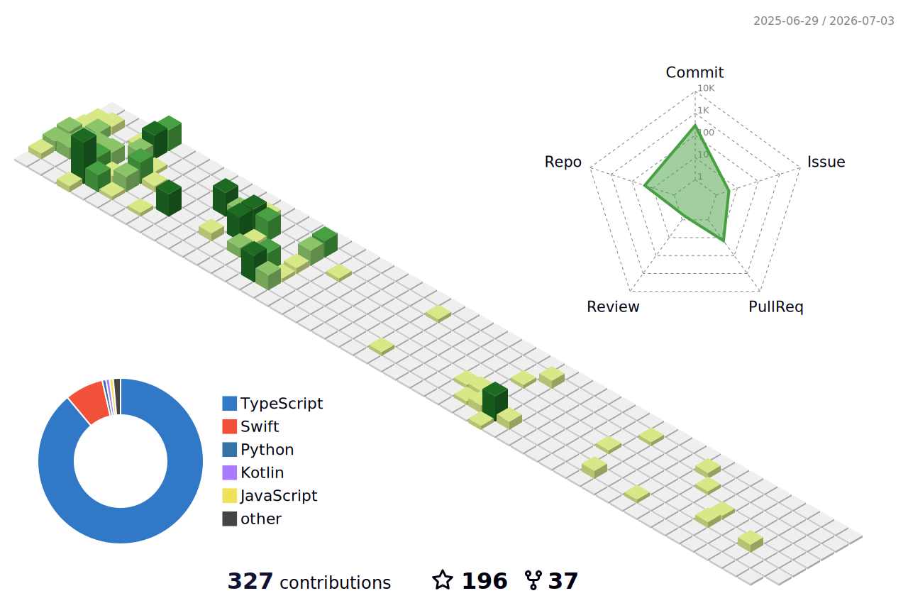

### 你好~ Hello~ 👋

✨我是一名前端开发攻城狮 小张 😄

✨I am a Web Developer，Amateur Web Designer who has just worked for one year, XiaoZhang 😄

✨欢迎来到我的GitHub主页

✨Welcome to my GitHub page
<!--
**7148505/7148505** is a ✨ _special_ ✨ repository because its `README.md` (this file) appears on your GitHub profile.

Here are some ideas to get you started:

- 🔭 I’m currently working on ...
- 🌱 I’m currently learning ...
- 👯 I’m looking to collaborate on ...
- 🤔 I’m looking for help with ...
- 💬 Ask me about ...
- 📫 How to reach me: ...
- 😄 Pronouns: ...
- ⚡ Fun fact: ...
-->

<!--START_SECTION:waka-->


**🐱 My GitHub Data** 

> 📦 176.8 kB Used in GitHub's Storage 
 > 
> 🏆 30 Contributions in the Year 2026
 > 
> 🚫 Not Opted to Hire
 > 
> 📜 74 Public Repositories 
 > 
> 🔑 4 Private Repositories 
 > 
**I'm an Early 🐤** 

```text
🌞 Morning                3676 commits        ███████████░░░░░░░░░░░░░░   42.68 % 
🌆 Daytime                4438 commits        █████████████░░░░░░░░░░░░   51.53 % 
🌃 Evening                499 commits         █░░░░░░░░░░░░░░░░░░░░░░░░   05.79 % 
🌙 Night                  0 commits           ░░░░░░░░░░░░░░░░░░░░░░░░░   00.00 % 
```
📅 **I'm Most Productive on Friday** 

```text
Monday                   1412 commits        ████░░░░░░░░░░░░░░░░░░░░░   16.39 % 
Tuesday                  1462 commits        ████░░░░░░░░░░░░░░░░░░░░░   16.97 % 
Wednesday                1866 commits        █████░░░░░░░░░░░░░░░░░░░░   21.66 % 
Thursday                 1520 commits        ████░░░░░░░░░░░░░░░░░░░░░   17.65 % 
Friday                   2110 commits        ██████░░░░░░░░░░░░░░░░░░░   24.50 % 
Saturday                 60 commits          ░░░░░░░░░░░░░░░░░░░░░░░░░   00.70 % 
Sunday                   183 commits         █░░░░░░░░░░░░░░░░░░░░░░░░   02.12 % 
```


📊 **This Week I Spent My Time On** 

```text
🕑︎ Time Zone: Asia/Shanghai

💬 Programming Languages: 
TypeScript               9 hrs 34 mins       ████████████░░░░░░░░░░░░░   48.28 % 
Vue.js                   8 hrs 38 mins       ███████████░░░░░░░░░░░░░░   43.59 % 
YAML                     29 mins             █░░░░░░░░░░░░░░░░░░░░░░░░   02.47 % 
JSON                     29 mins             █░░░░░░░░░░░░░░░░░░░░░░░░   02.46 % 
Markdown                 23 mins             ░░░░░░░░░░░░░░░░░░░░░░░░░   01.97 % 

🔥 Editors: 
VS Code                  19 hrs 49 mins      █████████████████████████   100.00 % 

🐱‍💻 Projects: 
gov                      8 hrs 41 mins       ███████████░░░░░░░░░░░░░░   43.87 % 
svn-commit-gen           5 hrs 20 mins       ███████░░░░░░░░░░░░░░░░░░   26.94 % 
web-ide                  2 hrs 28 mins       ███░░░░░░░░░░░░░░░░░░░░░░   12.51 % 
server                   2 hrs 24 mins       ███░░░░░░░░░░░░░░░░░░░░░░   12.18 % 
bolt.diy.back            27 mins             █░░░░░░░░░░░░░░░░░░░░░░░░   02.35 % 

💻 Operating System: 
Mac                      19 hrs 49 mins      █████████████████████████   100.00 % 
```

**I Mostly Code in TypeScript** 

```text
TypeScript               10 repos            ████████░░░░░░░░░░░░░░░░░   32.26 % 
JavaScript               9 repos             ███████░░░░░░░░░░░░░░░░░░   29.03 % 
Vue                      6 repos             █████░░░░░░░░░░░░░░░░░░░░   19.35 % 
Swift                    2 repos             ██░░░░░░░░░░░░░░░░░░░░░░░   06.45 % 
PHP                      1 repo              █░░░░░░░░░░░░░░░░░░░░░░░░   03.23 % 
```


**Timeline**


 Last Updated on 28/03/2026 19:09:55 UTC
<!--END_SECTION:waka-->


[](https://github.com/anuraghazra/github-readme-stats)

[](https://github.com/anuraghazra/github-readme-stats)


