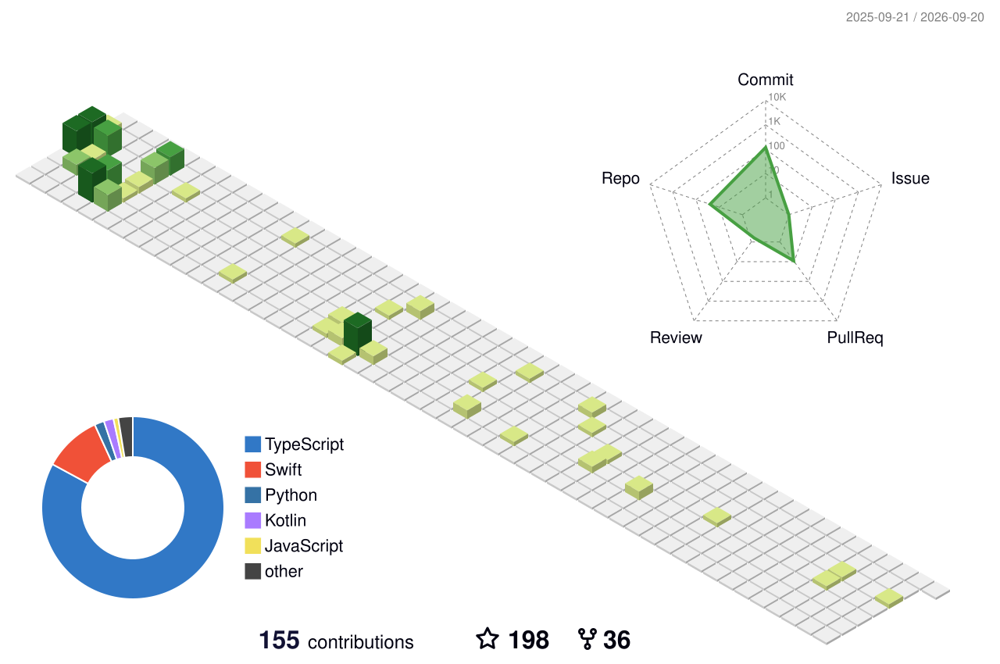

### 你好~ Hello~ 👋

✨我是一名前端开发攻城狮 小张 😄

✨I am a Web Developer，Amateur Web Designer who has just worked for one year, XiaoZhang 😄

✨欢迎来到我的GitHub主页

✨Welcome to my GitHub page
<!--
**7148505/7148505** is a ✨ _special_ ✨ repository because its `README.md` (this file) appears on your GitHub profile.

Here are some ideas to get you started:

- 🔭 I’m currently working on ...
- 🌱 I’m currently learning ...
- 👯 I’m looking to collaborate on ...
- 🤔 I’m looking for help with ...
- 💬 Ask me about ...
- 📫 How to reach me: ...
- 😄 Pronouns: ...
- ⚡ Fun fact: ...
-->

<!--START_SECTION:waka-->


**🐱 My GitHub Data** 

> 📦 196.4 kB Used in GitHub's Storage 
 > 
> 🏆 44 Contributions in the Year 2026
 > 
> 🚫 Not Opted to Hire
 > 
> 📜 82 Public Repositories 
 > 
> 🔑 4 Private Repositories 
 > 
**I Mostly Code in JavaScript** 

```text
JavaScript               9 repos             ███████░░░░░░░░░░░░░░░░░░   28.12 % 
TypeScript               9 repos             ███████░░░░░░░░░░░░░░░░░░   28.12 % 
Python                   2 repos             ██░░░░░░░░░░░░░░░░░░░░░░░   06.25 % 
Swift                    2 repos             ██░░░░░░░░░░░░░░░░░░░░░░░   06.25 % 
Kotlin                   1 repo              █░░░░░░░░░░░░░░░░░░░░░░░░   03.12 % 
```


**Timeline**


 Last Updated on 24/07/2026 20:00:48 UTC
<!--END_SECTION:waka-->


[](https://github.com/anuraghazra/github-readme-stats)

[](https://github.com/anuraghazra/github-readme-stats)


