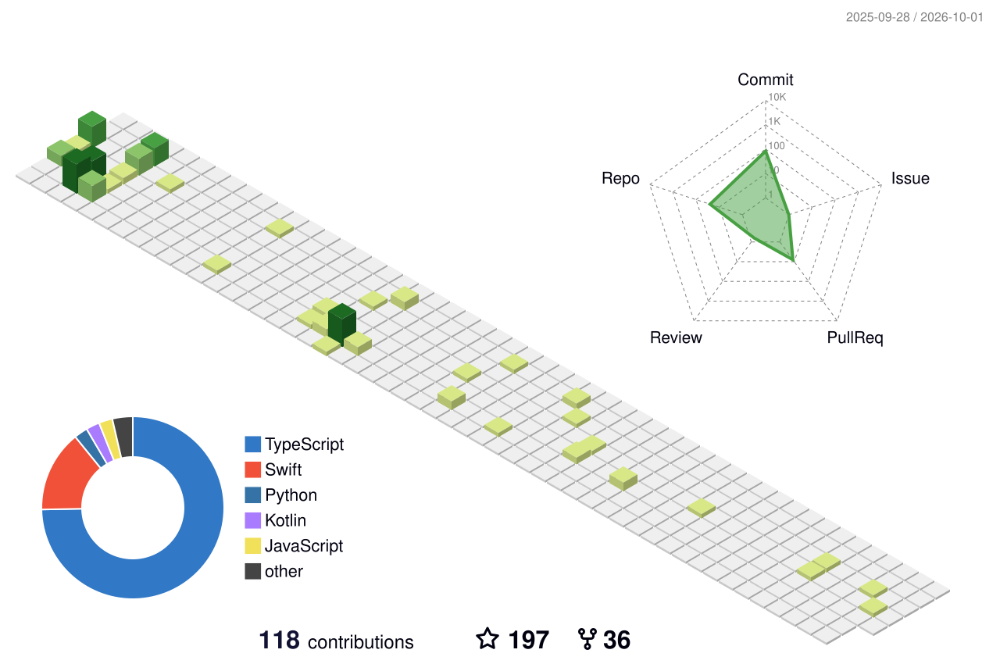

### 你好~ Hello~ 👋

✨我是一名前端开发攻城狮 小张 😄

✨I am a Web Developer，Amateur Web Designer who has just worked for one year, XiaoZhang 😄

✨欢迎来到我的GitHub主页

✨Welcome to my GitHub page
<!--
**7148505/7148505** is a ✨ _special_ ✨ repository because its `README.md` (this file) appears on your GitHub profile.

Here are some ideas to get you started:

- 🔭 I’m currently working on ...
- 🌱 I’m currently learning ...
- 👯 I’m looking to collaborate on ...
- 🤔 I’m looking for help with ...
- 💬 Ask me about ...
- 📫 How to reach me: ...
- 😄 Pronouns: ...
- ⚡ Fun fact: ...
-->

<!--START_SECTION:waka-->


**🐱 My GitHub Data** 

> 📦 250.0 kB Used in GitHub's Storage 
 > 
> 🏆 54 Contributions in the Year 2026
 > 
> 🚫 Not Opted to Hire
 > 
> 📜 86 Public Repositories 
 > 
> 🔑 4 Private Repositories 
 > 
**I'm an Early 🐤** 

```text
🌞 Morning                4385 commits        ███████████░░░░░░░░░░░░░░   42.94 % 
🌆 Daytime                5257 commits        █████████████░░░░░░░░░░░░   51.48 % 
🌃 Evening                569 commits         █░░░░░░░░░░░░░░░░░░░░░░░░   05.57 % 
🌙 Night                  0 commits           ░░░░░░░░░░░░░░░░░░░░░░░░░   00.00 % 
```
📅 **I'm Most Productive on Friday** 

```text
Monday                   1701 commits        ████░░░░░░░░░░░░░░░░░░░░░   16.66 % 
Tuesday                  1728 commits        ████░░░░░░░░░░░░░░░░░░░░░   16.92 % 
Wednesday                2210 commits        █████░░░░░░░░░░░░░░░░░░░░   21.64 % 
Thursday                 1815 commits        ████░░░░░░░░░░░░░░░░░░░░░   17.77 % 
Friday                   2483 commits        ██████░░░░░░░░░░░░░░░░░░░   24.32 % 
Saturday                 68 commits          ░░░░░░░░░░░░░░░░░░░░░░░░░   00.67 % 
Sunday                   206 commits         █░░░░░░░░░░░░░░░░░░░░░░░░   02.02 % 
```


📊 **This Week I Spent My Time On** 

```text
🕑︎ Time Zone: Asia/Shanghai

💬 Programming Languages: 
TypeScript               12 hrs 41 mins      ███████████████░░░░░░░░░░   61.58 % 
Markdown                 3 hrs 38 mins       ████░░░░░░░░░░░░░░░░░░░░░   17.66 % 
Other                    1 hr 33 mins        ██░░░░░░░░░░░░░░░░░░░░░░░   07.53 % 
HTML                     40 mins             █░░░░░░░░░░░░░░░░░░░░░░░░   03.26 % 
Swift                    39 mins             █░░░░░░░░░░░░░░░░░░░░░░░░   03.21 % 

🔥 Editors: 
Codex Vscode             14 hrs 39 mins      ██████████████████░░░░░░░   71.14 % 
VS Code                  4 hrs 11 mins       █████░░░░░░░░░░░░░░░░░░░░   20.33 % 
Claude Code              1 hr 45 mins        ██░░░░░░░░░░░░░░░░░░░░░░░   08.53 % 

🐱‍💻 Projects: 
grapes-demo              18 hrs 28 mins      ██████████████████████░░░   89.69 % 
RightClick-Pro           1 hr 21 mins        ██░░░░░░░░░░░░░░░░░░░░░░░   06.60 % 
observer-sessions        20 mins             ░░░░░░░░░░░░░░░░░░░░░░░░░   01.68 % 
obsidian-codex-users-zhan8 mins              ░░░░░░░░░░░░░░░░░░░░░░░░░   00.70 % 
https-console-cloud-googl6 mins              ░░░░░░░░░░░░░░░░░░░░░░░░░   00.55 % 

💻 Operating System: 
Mac                      20 hrs 36 mins      █████████████████████████   100.00 % 
```

🤖 **AI Coding This Week** 

```text
⏱ AI Coding Time: 20 hrs 19 mins (98.67%)

✍️ 5,387 lines written by AI, 1 lines written by hand (99.98% AI-written)

🔤 21,862,480 Input Tokens, 4,138,349 Output Tokens

💵 $907.60 Estimated AI Cost This Week

🧠 107 AI Sessions, 189 AI Prompts

GPT                      4,568 lines         ████████████████████░░░░░   81.85 % 
Opus                     585 lines           ███░░░░░░░░░░░░░░░░░░░░░░   10.48 % 
Codex-Vscode             385 lines           ██░░░░░░░░░░░░░░░░░░░░░░░   06.90 % 
Qwen                     43 lines            ░░░░░░░░░░░░░░░░░░░░░░░░░   00.77 % 
Sonnet                   0 lines             ░░░░░░░░░░░░░░░░░░░░░░░░░   00.00 % 

🔎 AI Coding Insights:
🤖 AI-Driven — 99.98% of written lines came from AI
📚 Verbose Prompter — average 23,812 characters per prompt
🔁 Iterative Prompter — average 2 prompts per session
🚀 High AI Trust — 0.02% of changed lines were hand-edited
```

**I Mostly Code in JavaScript** 

```text
JavaScript               9 repos             ███████░░░░░░░░░░░░░░░░░░   27.27 % 
Python                   2 repos             ██░░░░░░░░░░░░░░░░░░░░░░░   06.06 % 
Swift                    2 repos             ██░░░░░░░░░░░░░░░░░░░░░░░   06.06 % 
ASL                      1 repo              █░░░░░░░░░░░░░░░░░░░░░░░░   03.03 % 
Kotlin                   1 repo              █░░░░░░░░░░░░░░░░░░░░░░░░   03.03 % 
```


**Timeline**


 Last Updated on 06/10/2026 00:19:52 UTC
<!--END_SECTION:waka-->


[](https://github.com/anuraghazra/github-readme-stats)

[](https://github.com/anuraghazra/github-readme-stats)


