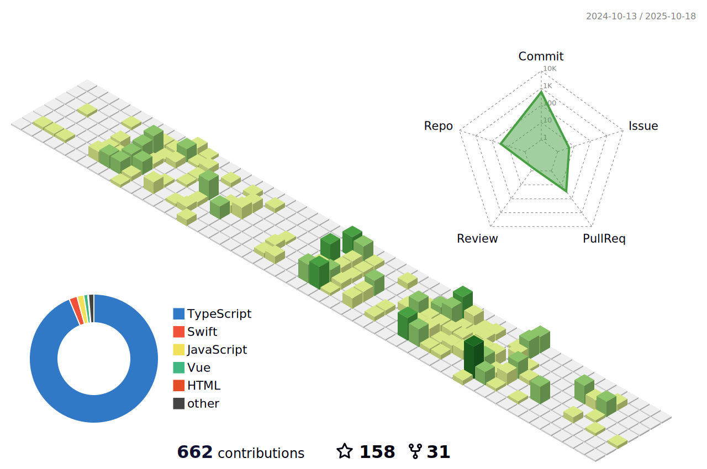

### 你好~  👋

✨我是一名前端开发攻城狮 小宁 😄

✨I am a Web Developer，Amateur Web Designer who has just worked for one year, XiaoNing 😄

✨欢迎来到我的GitHub主页

✨Welcome to my GitHub page
<!--
**7148505/7148505** is a ✨ _special_ ✨ repository because its `README.md` (this file) appears on your GitHub profile.

Here are some ideas to get you started:

- 🔭 I’m currently working on ...
- 🌱 I’m currently learning ...
- 👯 I’m looking to collaborate on ...
- 🤔 I’m looking for help with ...
- 💬 Ask me about ...
- 📫 How to reach me: ...
- 😄 Pronouns: ...
- ⚡ Fun fact: ...
-->

<!--START_SECTION:waka-->


**🐱 My GitHub Data** 

> 📦 46.1 kB Used in GitHub's Storage 
 > 
> 🏆 78 Contributions in the Year 2024
 > 
> 🚫 Not Opted to Hire
 > 
> 📜 42 Public Repositories 
 > 
> 🔑 1 Private Repositories 
 > 
**I'm an Early 🐤** 

```text
🌞 Morning                83 commits          ██████░░░░░░░░░░░░░░░░░░░   22.74 % 
🌆 Daytime                191 commits         █████████████░░░░░░░░░░░░   52.33 % 
🌃 Evening                91 commits          ██████░░░░░░░░░░░░░░░░░░░   24.93 % 
🌙 Night                  0 commits           ░░░░░░░░░░░░░░░░░░░░░░░░░   00.00 % 
```
📅 **I'm Most Productive on Tuesday** 

```text
Monday                   24 commits          ██░░░░░░░░░░░░░░░░░░░░░░░   06.58 % 
Tuesday                  156 commits         ███████████░░░░░░░░░░░░░░   42.74 % 
Wednesday                55 commits          ████░░░░░░░░░░░░░░░░░░░░░   15.07 % 
Thursday                 41 commits          ███░░░░░░░░░░░░░░░░░░░░░░   11.23 % 
Friday                   48 commits          ███░░░░░░░░░░░░░░░░░░░░░░   13.15 % 
Saturday                 15 commits          █░░░░░░░░░░░░░░░░░░░░░░░░   04.11 % 
Sunday                   26 commits          ██░░░░░░░░░░░░░░░░░░░░░░░   07.12 % 
```


📊 **This Week I Spent My Time On** 

```text
🕑︎ Time Zone: Asia/Shanghai

💬 Programming Languages: 
TypeScript               14 hrs 29 mins      ██████████░░░░░░░░░░░░░░░   40.50 % 
Vue.js                   13 hrs 25 mins      █████████░░░░░░░░░░░░░░░░   37.50 % 
JSON                     3 hrs 18 mins       ██░░░░░░░░░░░░░░░░░░░░░░░   09.24 % 
Markdown                 2 hrs 58 mins       ██░░░░░░░░░░░░░░░░░░░░░░░   08.29 % 
Other                    37 mins             ░░░░░░░░░░░░░░░░░░░░░░░░░   01.74 % 

🔥 Editors: 
VS Code                  35 hrs 47 mins      █████████████████████████   100.00 % 

🐱‍💻 Projects: 
console                  17 hrs 1 min        ████████████░░░░░░░░░░░░░   47.55 % 
svn-commit-gen           15 hrs 51 mins      ███████████░░░░░░░░░░░░░░   44.29 % 
svn-scm                  2 hrs 31 mins       ██░░░░░░░░░░░░░░░░░░░░░░░   07.05 % 
arco-design-vue          21 mins             ░░░░░░░░░░░░░░░░░░░░░░░░░   01.01 % 
ai-commit                2 mins              ░░░░░░░░░░░░░░░░░░░░░░░░░   00.10 % 

💻 Operating System: 
Linux                    35 hrs 47 mins      █████████████████████████   100.00 % 
```

**I Mostly Code in Vue** 

```text
JavaScript               5 repos             ███████░░░░░░░░░░░░░░░░░░   26.32 % 
TypeScript               4 repos             █████░░░░░░░░░░░░░░░░░░░░   21.05 % 
PHP                      1 repo              █░░░░░░░░░░░░░░░░░░░░░░░░   05.26 % 
Java                     1 repo              █░░░░░░░░░░░░░░░░░░░░░░░░   05.26 % 
Python                   1 repo              █░░░░░░░░░░░░░░░░░░░░░░░░   05.26 % 
```


**Timeline**


 Last Updated on 11/12/2024 18:50:01 UTC
<!--END_SECTION:waka-->


[](https://github.com/anuraghazra/github-readme-stats)

[](https://github.com/anuraghazra/github-readme-stats)

